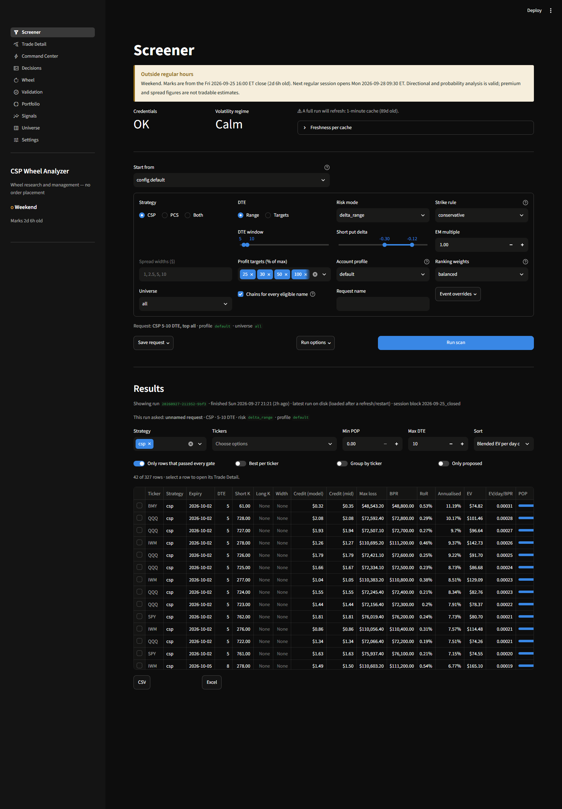
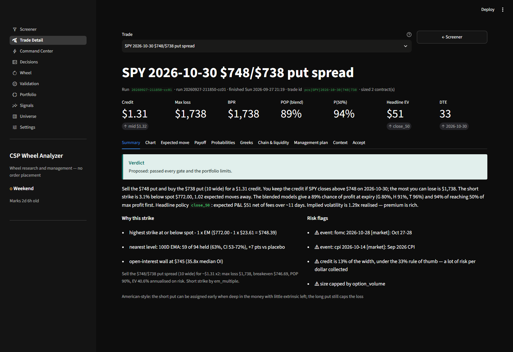
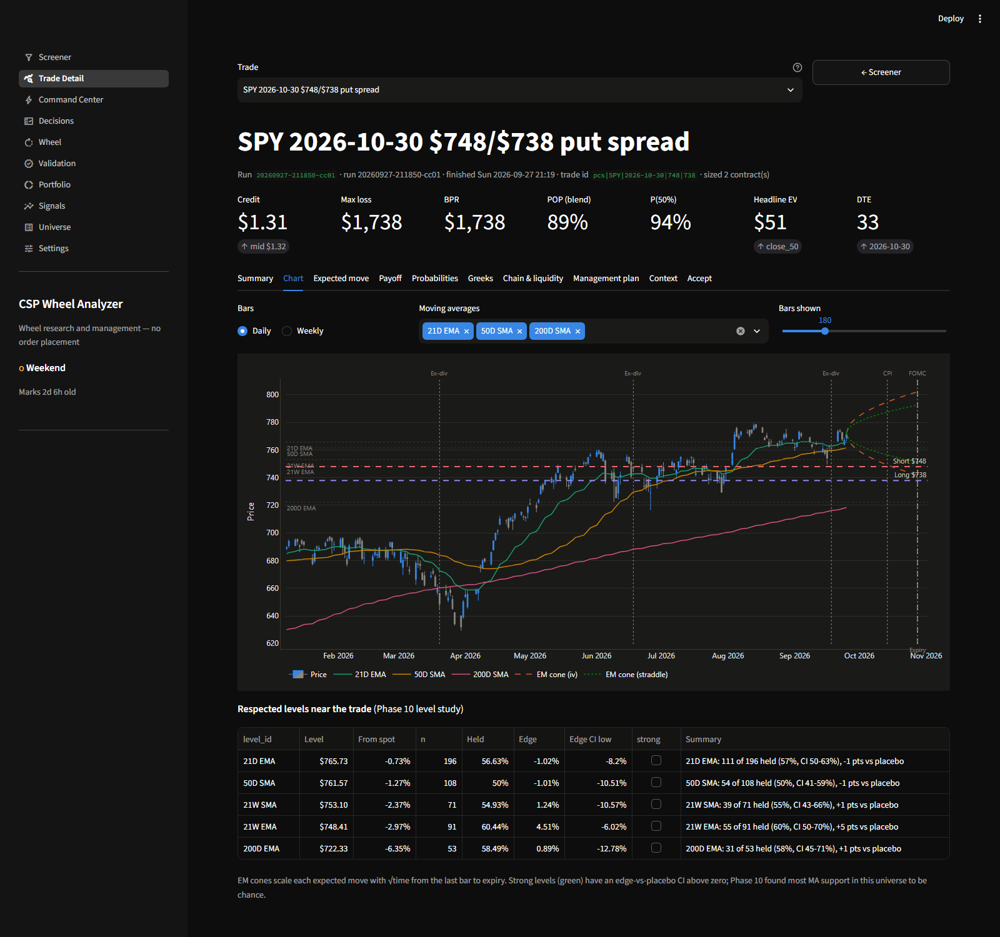
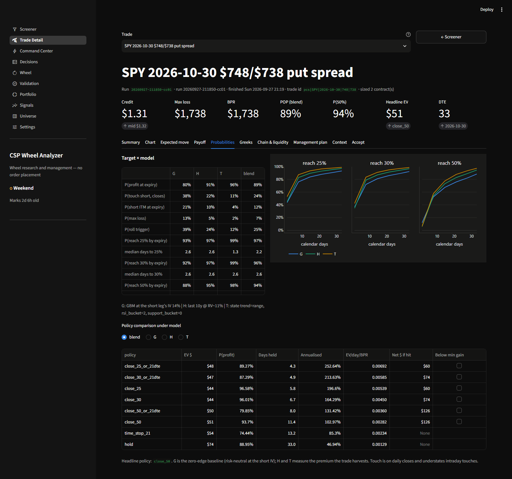
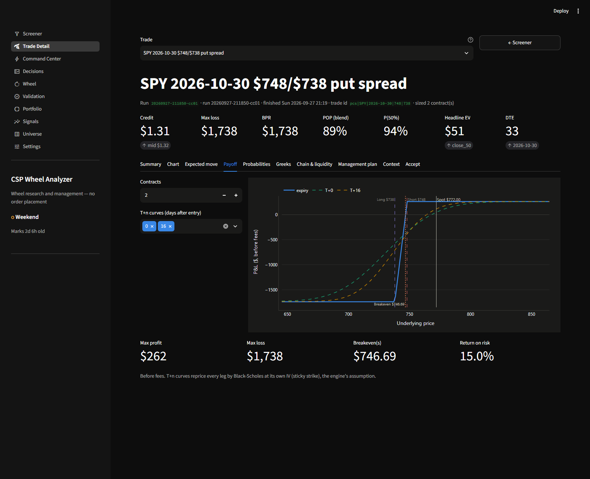
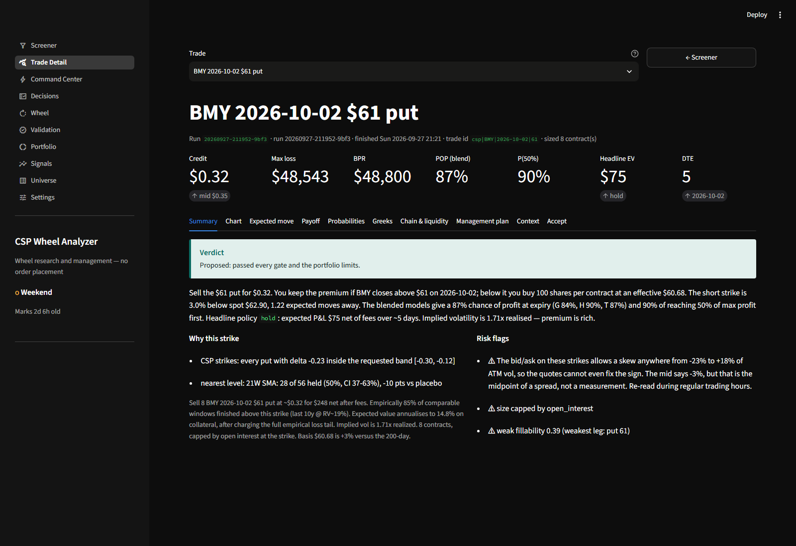
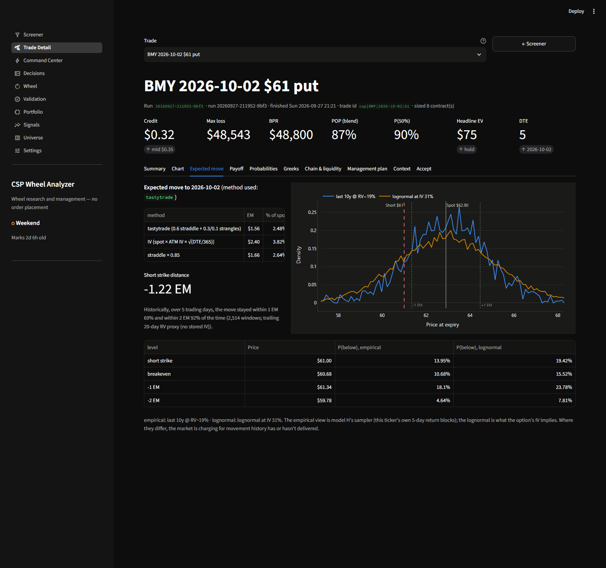
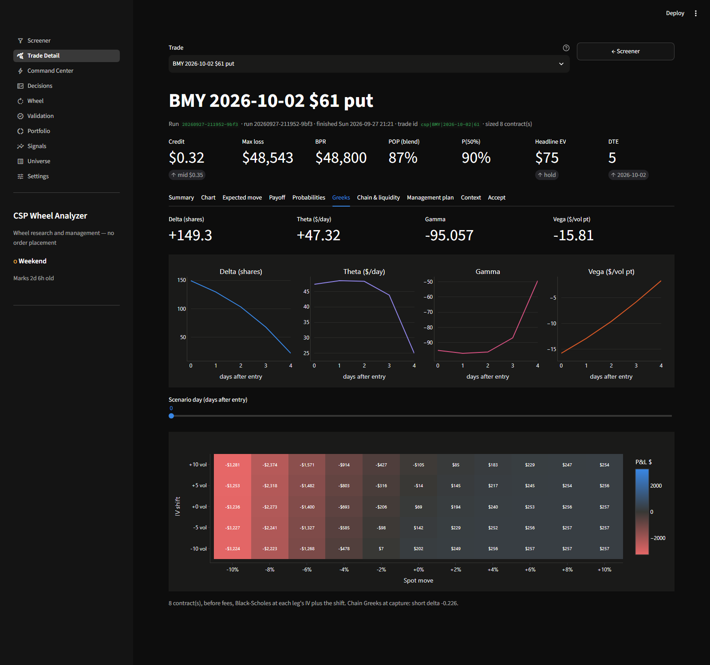
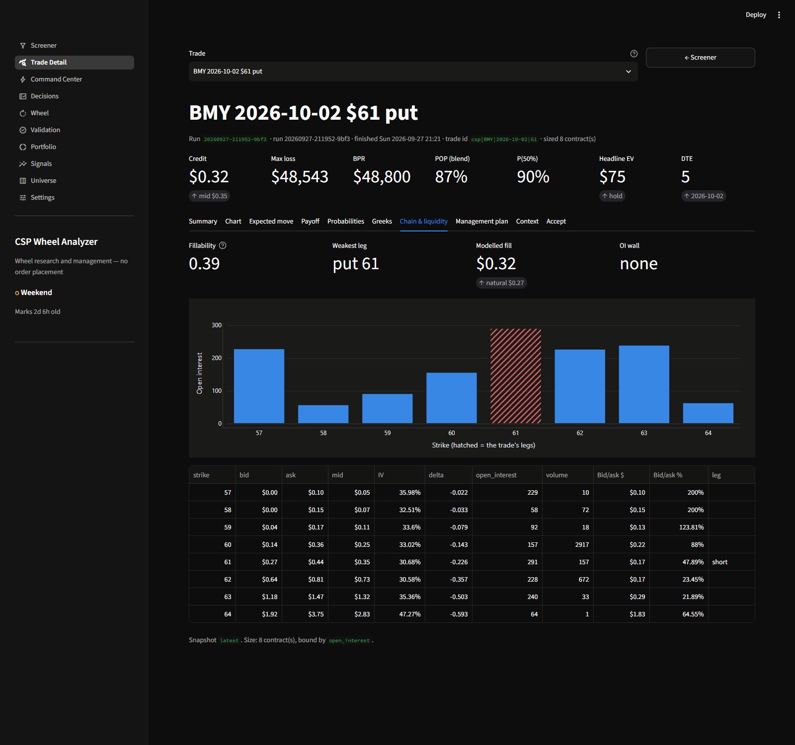

# Phase 14 summary — Screener UI, Trade Detail and ranking calibration

Date: 2026-09-27. Roadmap: [SCREENER_ROADMAP.md §C.6](SCREENER_ROADMAP.md).
Architecture: [ARCHITECTURE.md](ARCHITECTURE.md) §5–6.

## Headline

The workflow from Tom's brief is now in place. You ask the question on the
**Screener**, run it, pick a row, and a **Trade Detail** page opens for that
trade with ten tabs. From there you can send it to **Decisions**, or record
it directly if it is a CSP.

| Acceptance item | Result |
|---|---|
| AppTest passes for both pages | yes: `scripts/check_pages.py` **11/11 clean**; `tests/test_phase14.py` drives Trade Detail by query parameters |
| A PCS and a CSP row each open a fully populated Trade Detail | yes: SPY 30 Oct $748/$738 (run `20260927-211850-cc01`) and BMY 2 Oct $61p (run `20260927-211952-9bf3`). Each has 10 tabs, 7 charts, no exceptions, and nothing marked "unavailable" |
| Screenshots of both in the summary | §4, captured from the running app with headless Chrome |

The roadmap's Phase 11 and 13 notes also put the **calibration of the
underlying-ranking weights** in this phase. It is §3.

## Decisions

Tom said "proceed", so I used these defaults. Each can be changed.

| Question | Decision |
|---|---|
| Landing page | **Screener** is the default page. Command Center stays, for open positions, capacity and the rules in force. The session banner moved to `app/components/status.py`, and both pages use it. |
| Where saved requests live | `config/user_settings.yaml → scan_presets`, which is versioned like the other user settings. Each request is validated through `ScanRequest` before it is written. The files in `examples/` are offered as read-only starting points. |
| What the grid shows | Every row of the run. Rows that passed every gate are shown by default, and a toggle adds the rejected rows, which sort last and give the reason. Several rows per ticker are allowed, with "best per ticker" and "group by ticker" toggles. The default sort is the engine's rank: blended EV per day on BPR. |
| The Trade Detail URL | `?run=<run id>&trade=<trade id>`. The page reads the persisted run, never a re-run, so it shows exactly what the ranking saw, and the link works for as long as the run folder exists. With no parameters it falls back to the Screener's selection, then to the run's top row. |
| Accept | CSP rows record to the paper book from Trade Detail or Decisions. PCS rows show a Phase 15 note, as before. "Send to Decisions" puts the trade first on that page. |
| Ranking weights | A **`calibrated`** preset has been added. **The default stays `balanced`** until you decide (§6). |

## 1. What changed

- **`app/pages/8_Screener.py`** (new, the default page) has four parts:
  - **Status:** the session banner, credentials, regime, and one
    freshness line from `core.freshness`, such as "A full run will
    refresh: 1-minute cache (89d old)", with a per-cache table.
  - **Request form:** strategy (CSP / PCS / both); DTE range or target
    list; risk mode with its value (delta band, minimum POP, max loss $ or
    max % of capital); strike rule and EM multiple; widths; profit targets;
    account profile; ranking weights; universe (keyword, `tag:`, or a custom
    list); all names or top N; request name; and per-event policy overrides.
    Requests can be saved and deleted.
  - **Run**, with the same stage progress as Command Center.
  - **Results grid:** `st.dataframe` with single-row selection. It shows
    Ticker, Strategy, Expiry, DTE, Short K, Long K, Width, Credit (model and
    mid), Max loss, BPR, RoR, Annualised, EV, EV/day/BPR, POP, P(25/30/50/100%)
    as progress bars, days to 50%, IVR, IV/RV, EM distance, nearest support,
    liquidity score, events, the passed/proposed/best flags, and "rejected
    because". It has filters and CSV/Excel export. Selecting a row calls
    `st.switch_page` with the query parameters. Each selection opens only
    once, so going back does not bounce straight to Trade Detail again.
- **`app/pages/9_Trade_Detail.py`** (new): a trade picker, headline
  metrics, and ten tabs:
  - **Summary:** thesis, verdict, why this strike, risk flags.
  - **Chart:** daily or weekly candles, up to three MAs, nearby respected
    levels (strong ones in green, levels within 0.5% merged), strike lines,
    IV and straddle EM cones to expiry, and events. Market-wide events are
    shown only from today on.
  - **Expected move:** the three EM methods, historical containment, and
    empirical vs lognormal terminal densities with a P(below) table.
  - **Payoff:** at expiry and T+n for any number of legs, breakevens,
    adjustable contracts.
  - **Probabilities:** the target × model table, P(reach X%) curves, and
    the policy comparison under any model.
  - **Greeks:** net Greeks now, over time as small multiples, and a
    price × IV P&L heatmap on any day.
  - **Chain & liquidity:** puts around the legs, OI bars with the legs
    hatched, bid/ask width, and the fill estimate.
  - **Management plan:** target, time stop, roll trigger, minimum gain, and
    max loss or assignment. CSP rows also get a roll preview and a
    covered-call preview.
  - **Context:** IV, regime, earnings reactions, gap risk, and correlation
    with the book.
  - **Accept.**
- **`analytics/trade_detail.py`** (new, no Streamlit): everything the page
  computes, so it is unit-tested. It also holds `screener_grid`,
  `filter_grid` and `export_excel`.
- **`app/components/charts.py`**: seven builders that take any `Position`:
  `trade_price_chart`, `terminal_distribution_chart`, `payoff_chart`,
  `prob_curves_chart`, `greeks_time_chart`, `scenario_heatmap` and
  `chain_liquidity_chart`.
  - Leg colours are categorical red and violet, so the status colours stay
    reserved.
  - Subplot axes are styled like single charts.
  - Every chart has one y-axis; the Greeks are small multiples.
- **`app/pages/1_Decisions.py`**: the Screener or Trade Detail selection is
  shown first, with the same card and accept form. `paper.accept` records
  the selection's run id, and a rejected row with 0 contracts defaults the
  form to 1.
- **`core/user_settings.py`**: `scan_presets`, `save_scan_preset`,
  `delete_scan_preset` and `example_requests`.
- **`analytics/rank_calibration.py`** and
  **`scripts/calibrate_rank_weights.py`** (new): the calibration study in §3.
  Its results appear in a new Validation page section.
- **`config.yaml`**: the `calibrated` weight preset, with a comment giving
  its source.
- **`tests/test_phase14.py`** (21 tests).

**A bug found while testing:** Streamlit markdown read the `$` in prices
as LaTeX, and read the `~` in "~$0.32" as strikethrough. The Trade Detail
text is now escaped with `trade_detail.escape_md`. Some existing pages have
the same problem in a few captions, and I left those alone.

## 2. How the pages behave on real data

- **Weekly CSP run (`…9bf3`).** The grid lists 42 accepted rows of the
  327 evaluated. BMY $61p ranks first: blended EV $75 over 5 days, POP 87%.
  - Summary: sell at $0.32, effective basis $60.68, 1.22 EM below spot.
  - Risk flags: the bid/ask is too wide to fix the skew sign, the size is
    capped by open interest, and fillability is weak at 0.39.
  - Expected move: the empirical and lognormal P(below $61) are 14% and
    19%.
- **PCS run (`…cc01`).** SPY $748/$738, 2 contracts, credit $1.31, max
  loss $1,738, headline `close_50` EV $51.
  - Management plan: buy back at about $0.65 (P 94%, median 7 days),
    reassess at 21 DTE (day 12), max loss if SPY is under $738 (P 7%).
  - Chart: strong-level lines, and the FOMC (28 Oct) and CPI (14 Oct)
    markers inside the trade.
- Trade Detail renders in about 3 s headless. The empirical distribution
  (20,000 paths) and containment are cached per ticker.

## 3. Ranking-weight calibration

**Question.** Across names on the same date, does a higher component score
predict a better short-put outcome? Ordering names is the ranker's actual
job.

**Setup** (`analytics/rank_calibration.py`):
- Symbols: the 67 registry names.
- Entries: a shared calendar of every *h*-th SPY session over 8 years, so
  outcomes never overlap.
- Trade: a synthetic put **1 expected move** out, with IV = 20-day RV × 1.15.
- Outcome: the **share of premium kept** at expiry.
- Metric: the mean cross-sectional Spearman IC over dates, and its t-stat.

Every component is scored with `underlying_rank`'s own functions, using
only data up to the entry.

| Component (21 trading days, 86 dates) | Mean IC | t | IC > 0 |
|---|---|---|---|
| iv_rank (**proxy**: percentile of 20-day RV in its trailing year) | **+0.144** | **8.8** | 83% |
| drawdown | +0.025 | 1.4 | 60% |
| trend | +0.007 | 0.5 | 53% |
| support (**proxy**: nearest daily MA below spot, in EM) | −0.008 | −0.5 | 50% |
| iv_rv, liquidity | cannot be tested point-in-time | | |

At 5 trading days (357 dates) the pattern is the same: iv_rank +0.123
(t 13.9), drawdown +0.029 (t 3.2), trend +0.008, support +0.003.

Preset ICs, counting only their testable components (21 d / 5 d):

| Preset | 21 d | 5 d |
|---|---|---|
| premium | 0.150 | 0.129 |
| **calibrated** | 0.147 | 0.126 |
| liquidity | 0.115 | 0.099 |
| balanced | 0.114 | 0.097 |
| defensive | 0.065 | 0.059 |
| technical | 0.034 | 0.033 |

**Reading.** The volatility-rank component does the work. Names whose
realised vol sits high in its own trailing year went on to move *less*
than that vol implied, which is vol mean reversion. Names with compressed
vol are where the blowups came from. Trend and MA support add nothing
measurable, which matches Phase 10's finding that support is mostly
chance.

The `calibrated` preset uses iv_rank 0.54, iv_rv 0.20, liquidity 0.20,
drawdown 0.06, and trend and support 0. This is the mean of the 21-day and
5-day suggestions. `premium` scores the same within noise.

**Caveats, stated plainly**
- **The first draft was wrong, and I corrected it before using any
  numbers.**
  - It ran each name on its own date grid, so only 95 of 495 dates had
    enough names to compare.
  - It ranked on return on strike. With a fixed volatility premium, that
    rewards high-vol names mechanically: drawdown showed IC −0.42, all of
    it artefact. The premium-kept outcome is vol-neutral because every
    strike is 1 EM out.
- **iv_rank and support are proxies.** There is no IV history before 2026,
  and strong-level status comes from a full-history study that would leak
  the future.
- **Rich implied vol is not rewarded here.** With the trade priced at a
  fixed premium over RV, the study cannot credit a component for finding
  rich *implied* vol, which is what iv_rank and iv_rv are for.
- **The average outcome is negative.** The mean premium kept across all
  entries is −36%: tail losses on a 1-EM put exceed its credit on average
  under this pricing. The IC ranks names and says nothing about whether
  the trade pays.
- **iv_rv and liquidity keep judgement weights.**

## 4. Screenshots

Captured from `streamlit run app/main.py` with headless Chrome over the
DevTools protocol. The files are in [phase14/](phase14/).

| Page | File |
|---|---|
| Screener: status, request form, results grid |  |
| PCS SPY $748/$738, Summary |  |
| PCS, Chart (levels, strike lines, EM cones, events) |  |
| PCS, Probabilities |  |
| PCS, Payoff |  |
| CSP BMY $61p, Summary |  |
| CSP, Expected move |  |
| CSP, Greeks |  |
| CSP, Chain & liquidity |  |

## 5. Verification

- `python -m pytest tests -q`: **391 passed**, 21 of them in
  `test_phase14.py`. They cover:
  - the grid's derived columns and "nan"-text cleanup; filters,
    best-per-ticker, grouping, and rejected rows last; the Excel round trip;
  - plain-python records and the default trade; verdicts and deduplicated
    flags; the thesis text; the management plan with a time stop only above
    21 DTE;
  - payoff against `Position.payoff`, with T+n inside the bounds; Greek
    signs and scaling; scenario-grid monotonicity; EM cone √t scaling;
    terminal distributions on real SPY bars;
  - the chain window and leg flags; event filtering and level merging;
    chart builders;
  - scan presets (save, validate, delete);
  - the IC and suggested-weight maths; point-in-time panels on real bars;
    the shipped preset with the default unchanged;
  - AppTest of Trade Detail for the PCS and CSP rows, the Screener, and
    Decisions with a selection.
- `python scripts/check_pages.py`: **11/11 pages clean**.
- `python scripts/preflight.py`: no blocking issues. The known 1-minute
  archive warnings remain.
- `python scripts/calibrate_rank_weights.py`: 21 d in 11 s, 5 d in 27 s.
  Outputs are in `data/validation/rank_calibration_*`.

## 6. Decisions to confirm

1. **Default ranking preset:** switch from `balanced` to `calibrated` (or
   `premium`, which scores the same), or keep `balanced`?
2. **Trend and support weights:** set them to 0 in the other presets too,
   or keep them for users who want them as tie-breakers?
3. **Grid default:** show only rows that passed every gate (current), or
   every row?
4. **The Screener as landing page:** keep, or return Command Center to
   first place?

## 7. Known limits

- **Old run folders break links.** A Trade Detail link only works while its
  run folder exists, and old runs are not pruned or archived.
- **Chain & liquidity uses the latest snapshot.** It reads the run's chain
  block, falling back to the latest snapshot. After a newer capture, that
  tab can show newer quotes than the ones the run priced.
- **Previews use today's chain.** The roll and covered-call previews run on
  today's stored chain, not the run's.
- **Spread management waits for Phase 15.** There are no spread rolls, no
  PCS loss stop, and no multi-leg paper book.
- **The Greeks tab is model-based.** It reprices by Black-Scholes at each
  leg's IV (sticky strike). The chain's own Greeks at capture appear in the
  caption.
